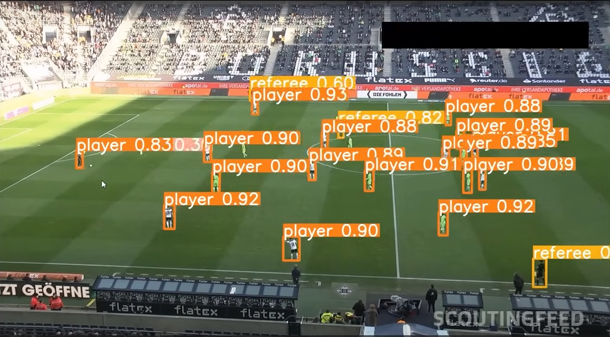
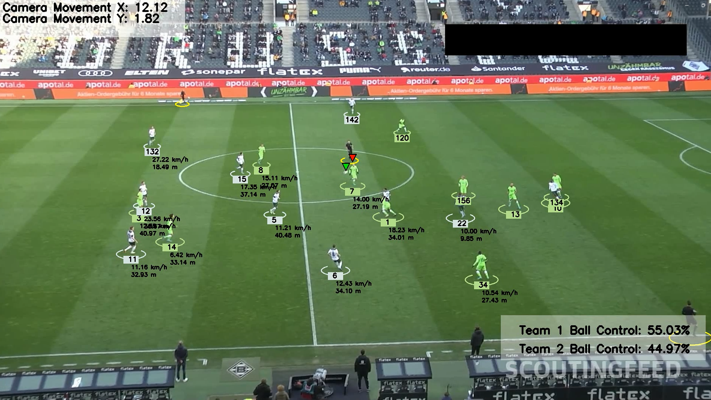

# Football Analysis - Deep Learning

## Introduction
This project leverages deep learning and artificial intelligence to automatically detect and track players, referees, and the football in match videos. Trained using Google Colab with the YOLO model, it also assigns players to teams via color-based clustering, estimates ball possession, accounts for camera movement, and calculates player speed and distance covered using advanced computer vision techniques.

## Modules Used
The following modules are used in this project:
- YOLO: AI object detection model
- Kmeans: Pixel segmentation and clustering to detect t-shirt color
- Optical Flow: Measure camera movement
- Perspective Transformation: Represent scene depth and perspective
- Speed and distance calculation per player

## Trained Models
- [Trained Yolo v5 (best.pt)](https://drive.google.com/file/d/1_RFGtg_uvqD8RvRgd44rJoJU5UQpVLZx/view?usp=sharing)
- [Trained Yolo v5 (last.pt)](https://drive.google.com/file/d/1GoRfC9d8fu7G9wdifJr_9IK93UUziJq9/view?usp=sharing)

## Sample video
-  [Input video](https://drive.google.com/file/d/1zTI0gUHgAD8AUGSFiibHFtpFVwLPIfDM/view?usp=sharing)

## Output video
-  [Final result](https://drive.google.com/file/d/12bIpGxk8tp4vHQbf98jp84A-lKEs12_K/view?usp=sharing)

## Requirements
To run this project, you need to have the following requirements installed:
- Python 3.x
- ultralytics
- supervision
- OpenCV
- NumPy
- Matplotlib
- Pandas
